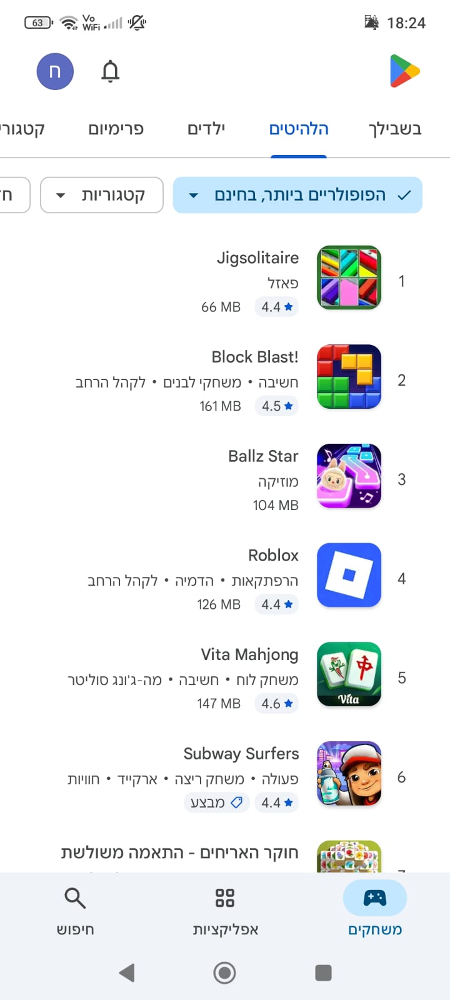
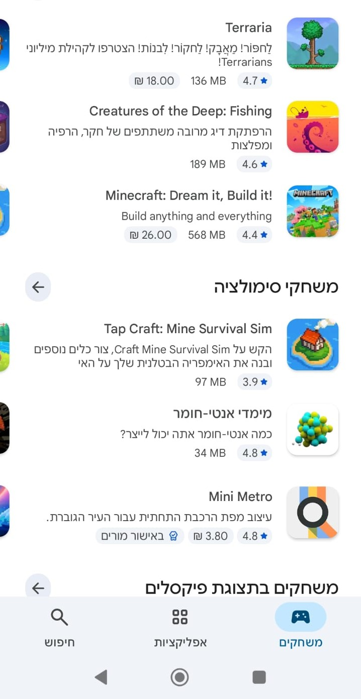
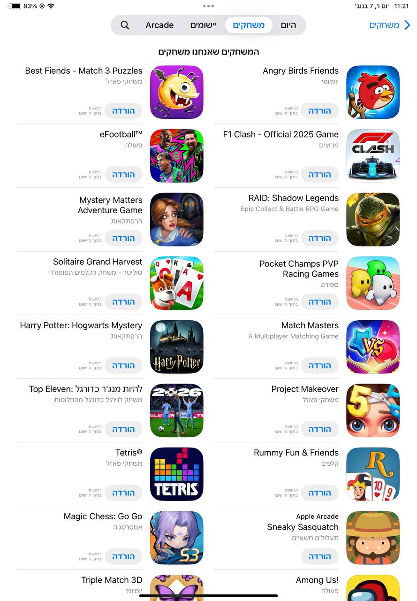
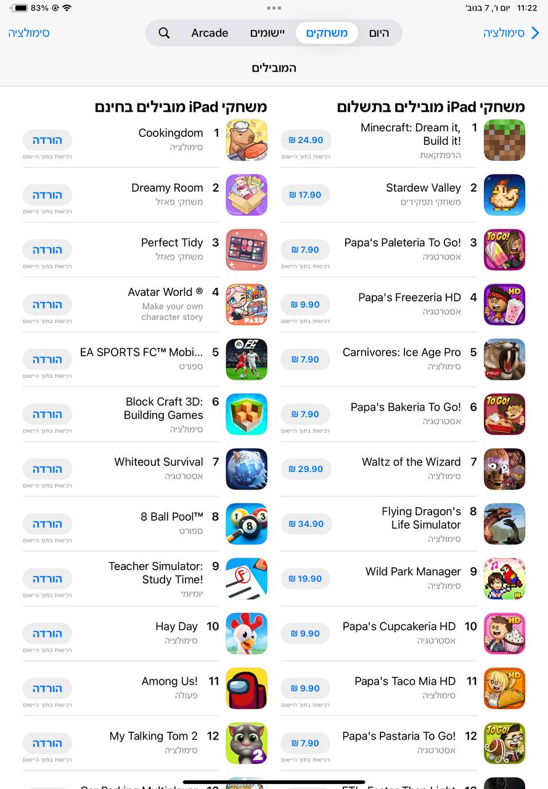
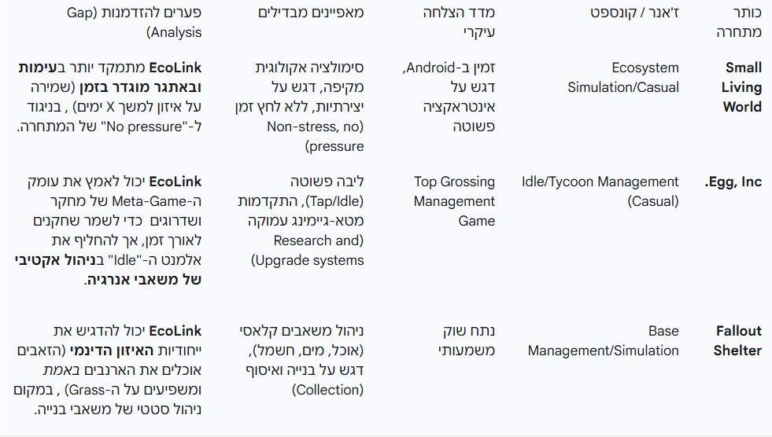

# קישור אקולוגי - EcoLink System 🌱

## תיאור כללי

**קישור אקולוגי (EcoLink)** הוא משחק סימולציה אקולוגית שבו השחקן בונה ומאזן מערכת אקולוגית חיה. השחקן ממקם צמחים, בעלי חיים, מקורות מים ואלמנטי אבע על grid דו-ממדי, והכל מתחיל ל"חיות" - צמחים גדלים, ארנבות אוכלות דשא, זאבים צדים ארנבות. המטרה היא לשמור על שרשרת המזון מאוזנת למשך זמן מוגדר, תוך התמודדות עם אירועי אבע (בצורות, גשם) ומשאבים מוגבלים.

**ז'אנר:** Simulation, Strategy, Educational  
**קהל יעד:** גילאי 10+, חובבי סימולציה, משחקי בניה, ומי שמתעניינים באקולוגיה

---

## 📊 סקר שוק מקיף

### 1. מצב השוק הגלובלי והישראלי

#### שוק הגיימינג העולמי
- **נתח הכנסות מובייל:** 49% מכלל שוק הגיימינג הגלובלי (~92 מיליארד דולר ב-2024)
- **פלטפורמה מובילה:** אנדרואיד עם 47.2% נתח הכנסות בשוק המובייל העולמי
- **קהל יעד עיקרי:** גילאים 10-34 (הפלח הגדול ביותר)

#### השוק הישראלי
- **מגמת 2024:** ירידה של 6% בהוצאות משתמשים
- **משחקים פופולריים:** עלייה במשחקי קז'ואל, פאזל ומילים
- **העדפות מקומיות:** משחקים קלים להעברת זמן, פחות מורכבים גרפית

#### תובנות מהרצאת אורח
- המשחקים הפופולריים ביותר בישראל הם דווקא הפשוטים, לא בהכרח המעוצבים גרפית
- בגלל נגישות הטלפונים החכמים, יש ביקוש למשחקים פשוטים ללא מורכבות יתר
- חשוב שהמשחק יכלול אתגר/עלילה כדי למנוע מחיקה מהירה
- מנגנוני Rewards (פרסומות, תגמולים יומיים) חיוניים לשימור שחקנים

---

### 2. קהל היעד 🎯

#### דמוגרפיה
- **גילאים:** 10-34 (פלח עיקרי), וקהל בוגר יותר (Mid-core Casual)
- **סוגי גיימרים:** Casual ו-Mid-Core Casual

#### מוטיבציות
- **מוטיבציה מרכזית:** פתרון חידות מערכתיות, שליטה וניהול, הפגת מתחים
- **מוטיבציה משנית:** התנסות חינוכית/סביבתית (Green Gaming)
- **מאפיין ישראלי:** צורך במשחקים ל"העברת זמן" פשוטה עם עומק המונע מחיקה מהירה

#### התאמה למשחק
EcoLink עונה על צרכים אלו:
- פעולת הליבה פשוטה (Drag and Drop)
- האתגר מורכב ומתמשך (שמירה על איזון)
- ערך חינוכי בהבנת מערכות אקולוגיות

---

### 3. ניתוח מתחרים 🔍

#### מגמות בחנויות האפליקציות

**Google Play (Android)**
- **משחקים פופולריים כלליים:** בעיקר פאזלים פשוטים
- **בז'אנר סימולציה:** משחקים מורכבים יותר, חלקם בתשלום
- **מאפיין:** משחקי סימולציה נוטים להיות ארוכי טווח, מתמקדים בבניה ללא אתגר מובנה
  
נביא כאן שתי תמונות מתוך כניסה פשוטה ל Google play שמראות מה המשחקים המובילים הן בצד הכללי והן תחת הקטגוריה של סימולציה והדמיה

<table>
  <tr>
    <td style="padding: 10px;">
      
    </td>
    <td style="padding: 10px;">
      
    </td>
  </tr>
</table>

**App Store (iOS)**
- **גיוון רב יותר:** משחקים מעוצבים ומורכבים יותר
- **בז'אנר סימולציה:** לא רק משחקי בניה, גם ניהול (מטבח, דמות)
- **קהל יותר מגוון** ונכון להשקיע

נביא כאן שתי תמונות מתוך כניסה פשוטה ל AppStore שמראות מה המשחקים המובילים הן בצד הכללי והן תחת הקטגוריה של סימולציה והדמיה

<table>
  <tr>
    <td style="padding: 10px;">
      
    </td>
    <td style="padding: 10px;">
      
    </td>
  </tr>
</table>

### פער בשוק
רוב המשחקים בסגנון מתמקדים בבנייה או פיתוח פשוט, **ללא אתגר מובנה** (כגון זמן, משאבים שנהרסים, אירועי אבע). EcoLink ממלא פער זה.

משחקים דומים נוספים וניתוח ושוני שלהם ניתן לראות בקובץ [רכיבים רשמיים](../Formal_Elements/formal-elements.md) 

משחקים דומים נוספים וניתוח טבלאי שלה (מאיסוף ע"י Gemini):  

---

### 4. הצעת ערך ייחודית (USP) ⭐

### מה מייחד את EcoLink?

1. **ליבה קז'ואלית + עומק מערכתי**
   - משחקיות קלה ללמידה (Drag and Drop)
   - מבטיח D1 Retention גבוה

2. **ניהול אנרגיה כאתגר**
   - משאב "נקודות האנרגיה" מוגבל
   - כל פעולה היא החלטה אסטרטגית
   - אינו "ארגז חול" חופשי

3. **יעד חינוכי/רציני**
   - הבנה מערכתית של שרשרת המזון
   - מודעות לשינויי אקלים
   - ערך משמעותי מעבר להעברת זמן

4. **אתגר מובנה**
   - בניגוד למשחקי סימולציה רגילים
   - כולל מגבלות זמן ואירועי אבע
   - שרשרת השלכות (Ecosystem Conflict)

---

### 5. מודל עסקי ומונטיזציה 💰

#### המודל המומלץ: Free-to-Play היברידי

**F2P (הורדה חינמית)**
- חיוני להורדה המונית
- ניצול גודל שוק אנדרואיד

**In-App Purchases (IAP)**
- **רכישת אנרגיה:** קניית "נקודות אנרגיה" נוספות
- **פתיחת מינים/Biomes קוסמטיים:** פתיחה מוקדמת של תוכן חדש
- **הסרת פרסומות:** רכישה חד-פעמית
- **התמקדות:** פריטים לשיפור Quality of Life, לא Pay-to-Win

**Rewarded Ads (פרסומות מתוגמלות)**
- **קריטי לשוק הישראלי** (68% מהשחקנים מעדיפים פורמט זה)
- **שימושים:**
  - בונוס אנרגיה
  - הארכת זמן בשלבים מאתגרים
  - פתיחת "Knowledge Points"

#### יתרונות המודל
- מאזן בין ירידת ההוצאות בישראל לפוטנציאל הכנסה
- הקהל שאינו משלם הופך למקור הכנסה דרך פרסומות
- שימור פוטנציאל הכנסה מקהל נשי/בוגר (נוטה ל-IAP)

---

### 6. אסטרטגיית שיווק והפצה 📱

#### פלטפורמת השקה
**Google Play (אנדרואיד)** - פלטפורמה ראשית
- דומיננטיות בשוק העולמי
- נגישות למגוון רחב של משתמשים

#### ערוצי שיווק
1. **רשתות חברתיות:**
   - Facebook, YouTube
   - פרסום בתוך משחקים אחרים
   
2. **טכנולוגיה:**
   - קריאייטיבים מותאמים אישית באמצעות AI
   - התמודדות עם עליית עלויות CPA

3. **הפצה דיגיטלית:**
   - פרסומות ממוקדות
   - מינוף קהילות גיימינג

#### מיקוד השיווק
- הדגשת ה-USP הכפול (קז'ואל וחינוכי)
- רגעים קז'ואליים (הוספת חיות) + רגעים דרמטיים (איום אקולוגי)

---

### 7. LiveOps - אירועים חיים 🎮

**מטרה:** שימור שחקנים לאחר ההורדה הראשונית, עידוד חזרה יומית/שבועית

#### אירועים מוצעים

**אתגר שבועי: "אתגר היציבות המוחלטת"**
- Biome זמני חדש עם חוקים משתנים (מדבר קיצוני, סופות חול)
- השגת איזון למשך 5 ימים רצופים
- **תגמול:** Knowledge Points, מטבע פרימיום, זנים נדירים

**אירוע Co-op חברתי: "פרויקט שיקום עולמי"**
- כל הקהילה תורמת משאבים למטרה גלובלית
- השגת מטרה = תגמול קולקטיבי לכולם
- **יתרון:** יצירת תחושת שייכות, חיזוק Retention

---

### 8. משחק-על (Meta-Game) 🎯

**מטרה:** מתן "עלילה/אתגר" למניעת מחיקה מהירה

#### מערכת "מחקר ופיתוח" (Research Tree)

**שימוש ב-Knowledge Points:**
- צבירה דרך השלמת שלבי ליבה מוצלחים
- שימוש למחקר טכנולוגיות אקולוגיות חדשות

**שדרוגים אפשריים:**
- צמחים שצומחים 10% מהר יותר
- יצירת גשם בעלות אנרגיה מופחתת
- מינים פחות פגיעים להכחדה

**התאמה אישית/קוסמטיקה:**
- בניית "מרכז בקרת המערכת"
- קישוט מעבדה
- צפייה במינים שנאספו (Collection)

#### תרומת ה-Meta-Game
- הופך כל שלב ליבה למטרה גדולה יותר
- יוצר התקדמות קבועה
- מצדיק השקעה ב-IAP או Rewarded Ads

---

### 9. ניתוח סיכונים והזדמנויות ⚠️💡

#### סיכונים
- **ירידה בהוצאות בישראל:** השפעה על Hyper-Casual
- **שוק רווי:** תחרות על קהל היעד
- **שימור משתמש:** אתגר בז'אנר הקז'ואלי

#### הזדמנויות
- **פער בשוק:** חסר משחק סימולציה אקולוגית עם אתגר מובנה
- **קהל יעד נשי:** 53% מהשוק + נטייה גבוהה ל-IAP
- **ערך חינוכי:** מושך קהל מודע ומחפש משמעות
- **מודל היברידי:** מתאים לירידת ההוצאות (Rewarded Ads + IAP)
- **נישה ייחודית:** שילוב קז'ואל + מערכתיות + חינוך

#### אסטרטגיות התמודדות
- מיקוד במודל F2P היברידי חזק
- בניית Meta-Game עמוק לשימור
- LiveOps מתוכנן למעורבות מתמשכת
- שיווק חכם ממוקד USP

---

### 10. סיכום והמלצות ✅

#### מסקנות עיקריות

**כדאיות הפרויקט:**  
רעיון המשחק **EcoLink כדאי לפיתוח ראשוני** (Feasible), בתנאי אימוץ מודל Hybrid-Casual מובהק.

**קיום שוק:**
- הז'אנר בין Top-3 בהורדות ב-Google Play בישראל
- קהל היעד נוטה לבצע IAP בז'אנר זה
- אתגר: שימור משתמש ומונטיזציה יעילה

#### המלצות קונקרטיות להמשך

1. **בניית אבטיפוס (MVP) ממוקד Meta-Game**
   - מיקוד ב"לולאת ההתקדמות" (Core Loop + Meta-Game)
   - וידוא שהשחקן חוזר למחרת (בדיקת Day 1 Retention)

2. **אופטימיזציה של מערכת האנרגיה**
   - בחינת קצב התחדשות "נקודות האנרגיה"
   - איזון נגישות Rewarded Ads למניעת תסכול
   - האנרגיה = משאב המונטיזציה והשימור העיקרי

3. **שיווק חכם**
   - מינוף USP הכפול (קז'ואל + חינוכי)
   - קריאייטיב המדגיש רגעים קז'ואליים + דרמטיים
   - מיקוד בערוצים מתאימים לקהל היעד

4. **מדידה ומעקב**
   - D1/D7 Retention Rates
   - CPA (Cost Per Acquisition)
   - ARPU (Average Revenue Per User)
   - מעקב אחר ביצועי LiveOps

---

## 📚 מקורות

### מחקר שוק ונתונים
- [Grand View Research - Mobile Games Market](https://www.grandviewresearch.com/industry-analysis/mobile-games-market)
- [Ynet - דו"ח כנס גיימינג 2024](https://www.ynetnews.com/business/article/rjzdkmdhyl)
- [Zorka Agency - Israel Mobile Game Market](https://zorka.agency/blog/in-a-nutshell-israel-mobile-game-market/)
- [Udonis - Mobile Gaming Statistics](https://www.blog.udonis.co/mobile-marketing/mobile-games/mobile-gaming-statistics)

### מונטיזציה ו-LiveOps
- [Playwire - Game Monetization Models](https://www.playwire.com/blog/6-game-monetization-models)
- [Juego Studio - LiveOps Strategy](https://www.juegostudio.com/blog/tips-to-build-a-winning-liveops-strategy-for-games)
- [Gamigion - Casual Games LiveOps](https://www.gamigion.com/top-casual-games-liveops-strategy/)

### מחקר אקדמי
- [PMC - Educational Potential in Ecological Simulation Games](https://pmc.ncbi.nlm.nih.gov/articles/PMC6930897/)

---

## 📎 הערות נוספות

- [רכיבים רשמיים (Formal Elements)](formal-elements.md)
- שיחה ועזרה עם איסוך הנתונים והצגה שלהם [Gemini](https://gemini.google.com/share/114ec59c8bb0)  
  נעיר: כלי AI יכולים לעזור באיוסך מידע וסריקת מאמרים ומחשקים הנפוצים יחד עם ניתוח נתונים והצגה ראשונית של הנתונים 
- חיפוש באינרטנט סביב מילות מפתח "משחקי מחשב מומלצים 2025" https://unrealengine5.online/%D7%9E%D7%A9%D7%97%D7%A7%D7%99%D7%9D/  
הערה: בחיפוש מהיר באינטרנט רוב מחשקי המחשב המובילים בשנה האחרונה שנקלב, יותר בתחום הגיימינג הכבד, כלומר פחות משחקי מובייל אלא יותר משחקי מחשב עם גרפיקות יותר מעוצבות ומורכבות במשחק 
- הרצאת אורח מחברת Beach Bum
- חיפוש ממשי בחנויות המשחקים של Googleplay ו AppStore
---

**EcoLink - שמירה על איזון, יצירת חיים** 🌍🦋

