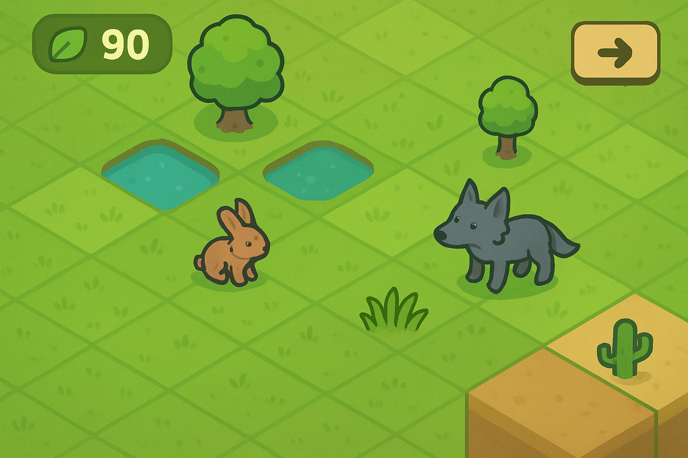
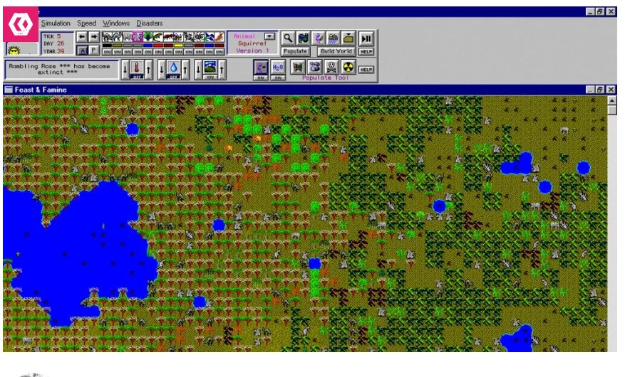
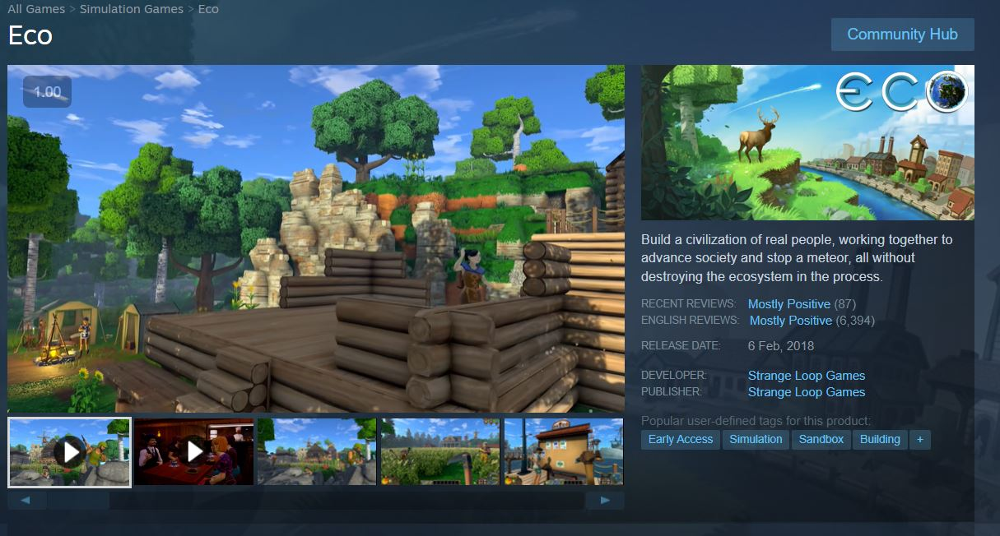
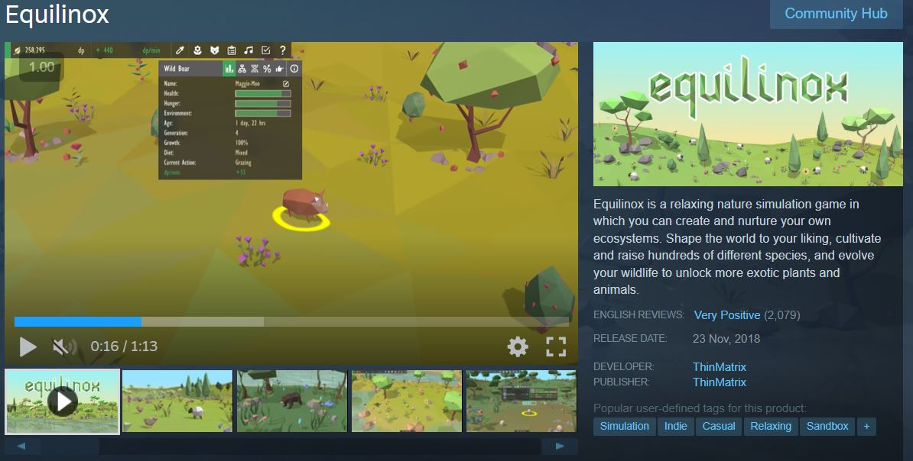

# כותרת ראשית: EcoLink - קישור אקולוגי

**tagline: צור עולם חי ושמור על האיזון הטבעי - כל יצור תלוי בשני**

## מהות המשחק

אתה מטפל של עולם דיגיטלי קטן. אתה ממקם צמחים, בעלי חיים ומשבצות שטח (אדמה, מים, הרים), וכל דבר מקיים אינטראקציה דינמית עם הסביבה. המטרה שלך היא לשמור על המערכת האקולוגית יציבה - שרשרת המזון, המשאבים והאקלים חייבים להישאר מאוזנים. הזמן עובר אוטומטית, ואתה צריך להגיב לשינויים ולאירועים כדי למנוע התמוטטות. המשחק משלב אסטרטגיה, תכנון וידע אקולוגי בצורה כיפית.

המשחק מיועד למחשב רגיל (PC) עם פקדי עכבר, ואפשר להרחיב למכשירים ניידים בעתיד.

*תמונה: עולם צבעוני עם דשא, ארנבות, זאבים ונהר זורם*

---

## רכיבים רשמיים

### 1. שחקנים

* **קהל יעד**: המשחק מיועד לשחקנים בגילאי 10+, חובבי משחקי סימולציה, אסטרטגיה ובנייה. מתאים למי שאוהב משחקים כמו SimCity, Terraria, או משחקי ניהול משאבים. מתאים גם למי שמעוניין בנושאים של אקולוגיה, טבע וביולוגיה באופן כיפי.

* **מספר שחקנים**: שחקן יחיד (Single Player)
  
### 2. יעדים

**יעדי המשחק:**
* יעד מרכזי: לשמור על המערכת האקולוגית מאוזנת למשך X ימים
* יעדי משנה: להגיע לאוכלוסייה יציבה של כל מין, להימנע מהכחדות, לעבור אירועים אקראיים (בצורת, גשם זלזלי)
* היכורת עם עולם גינון ואקולוגיה, למשל יש צמחים שיכולים להיות אחד ליד השני ויש כאלה שלא, חיות שיכולות להזיק אחת לשניה או לצמחים. להבין שטיפול בגינה דורש קצת מעבר להשקיה של הצמח 

**הודעת יעדים לשחקן:**
* בתחילת כל שלב תופיע הודעה: "שמור על המערכת יציבה ל-10 ימים"
* בר "Ecosystem Health" על המסך מראה את מצב המערכת בזמן אמת
* התראות צבעוניות כשמשהו לא מאוזן ("⚠️ ארנבות נמוכים מדי!", "⚠️ זאבים רעבים!")
* בסוף כל שלב - סיכום עם סטטיסטיקות ופידבק

### 3. תהליכים

**תהליך ההתחלה - 30 השניות הראשונות:**

השחקן רואה מסך ריק עם grid של משבצות אדמה. הודעה: "ברוך הבא ל-EcoLink! גרור משבצות מהתפריט לעולם". תפריט פשוט בצד עם 3 אייקונים: דשא 🌱, ארנב 🐰, מים 💧. השחקן גורר דשא למסך - הוא מופיע ומתחיל לצמוח. אחרי מספר שניות, מתבקש להוסיף ארנב. הארנב מתחיל לזוז, לאכול דשא, והמשחק "מתעורר לחיים". הודעה: "שים לב! הארנבים צריכים דשא כדי לשרוד". טיימר מתחיל לספור ימים.

**תהליך הליבה - רצף פעולות חוזר:**

השחקן עוקב אחרי האוכלוסיות - איך הדשא גדל, איך הארנבים רבים או מתים, איך הזאבים צדים. הוא מזהה סימני אזהרה (צבעים אדומים, התראות, גרפים יורדים) ומחליט מה להוסיף או להסיר מהמערכת. השחקן גורר אלמנט חדש (צמח, חיה, מים) מהתפריט למסך עם העכבר. הזמן עובר (ניתן להאיץ ×2, ×5), והשחקן רואה את ההשפעה. אם צריך, הוא מוסיף עוד שינויים או מסיר יצורים. התהליך חוזר - כל הזמן מאזן ומגיב לאירועים ושינויים.

**תהליך הסיום:**

השחקן מצליח לשמור על האיזון למשך X ימים (המטרה). מסך "SUCCESS!" עם סטטיסטיקות: אוכלוסיות ממוצעות, מספר מינים ששרדו, דירוג איזון. או פותח שלב הבא או biome חדש. אופציה: "המשך במצב חופשי" (sandbox) עם העולם שיצר. ניקוד מבוסס על: זמן איזון, מגוון מינים, התמודדות עם אירועים.

**למידת התהליכים:**

Tutorial אינטראקטיבי - השלבים הראשונים מלמדים כל מכניקה בנפרד. טיפים על המסך כשנתקלים במצב חדש ("זאבים זקוקים לארנבים כמזון"). Info tooltips כשמרחפים מעל אלמנט (מראה מה הוא אוכל, מה צריך לשרוד). "אנציקלופדיה" פנימית שאפשר לפתוח בכל רגע.

 4. חוקים

**חוקים מגבילים:**
* השחקן יכול להוסיף אלמנטים רק כשיש לו "נקודות אנרגיה" (משאב מוגבל)
* לא ניתן למקם אלמנטים על משבצות לא מתאימות או תפוסות (דג במדבר = לא עובד)
* מספר מוגבל של משבצות בעולם (grid בגודל 20×20 למשל)
* כל מין דורש תנאים מינימליים (מים, מזון, טמפרטורה) כדי לשרוד
* אין מחיקה חופשית - הסרת יצור עולה נקודות אנרגיה
* אירועים אקראיים (בצורת, שיטפון) מגיעים מדי פעם ומשנים תנאים

**חוקי תוצאות:**
* **צמיחת צמחים**: דשא גדל ליד מים, קוצב גידול לפי זמינות מים
* **רבייה**: בעלי חיים מתרבים אם יש מספיק מזון ומקום
* **רעב**: אם אין מזון, האוכלוסייה יורדת (מוות מרעב)
* **טריפה**: טורפים אוכלים טרף לפי חוקי שרשרת המזון (זאב אוכל ארנב)
* **הכחדה**: אם אוכלוסייה מגיעה ל-0, המין נעלם מהעולם
* **איזון**: אם כל האוכלוסיות יציבות (לא עולות/יורדות בצורה דרמטית) ל-X ימים = ניצחון
* **אירועי טבע**: בצורת מפחיתה צמחים, גשם מגדיל אותם

**למידת החוקים:**

Tutorial מסביר כל מכניקה לראשונה. Tooltips אינטראקטיביים: כשמרחפים מעל יצור רואים "אוכל: דשא" או "טורף: זאב". גרפים על המסך מראים קשרים (קו בין ארנב לזאב, בין דשא למים). "הדרכה אקולוגית" בתחילת המשחק: הסבר קצר על שרשרת מזון. אפשרות "למה המערכת קרסה?" בסוף שלב כושל - פידבק מדויק.

### 5. משאבים

**סוגי משאבים:**
* **נקודות אנרגיה (Energy Points)**: המטבע המרכזי להוספת אלמנטים
* **זמן**: המשחק רץ בזמן אוטומטי - השחקן יכול להאיץ/לעצור
* **מינים פתוחים**: בהתחלה מוגבל למינים בסיסיים, יותר מינים נפתחים עם התקדמות
* **Biomes פתוחים**: מתחילים עם biome אחד (grassland), פותחים יותר
* **Knowledge Points**: נקודות שמרוויחים בכל שלב מוצלח, משמשות לפתיחת תוכן

**תועלת המשאבים:**
* אנרגיה מאפשרת להוסיף צמחים/חיות/משבצות טבע
* זמן: שליטה בקצב המשחק - מאפשרת לראות שינויים מהר או לתכנן לאט
* מינים: מגוון רחב יותר = פתרונות יצירתיים יותר לאיזון
* Biomes: סביבות שונות עם אתגרים שונים (מדבר = פחות מים, טונדרה = קר)
* Knowledge: משמש ל"מחקר" של שדרוגים (צמחים שגדלים מהר יותר, חיות עמידות יותר)

**השגת משאבים:**
* אנרגיה מתחדשת לאט עם הזמן (1 נקודה כל 5 שניות)
* בונוס אנרגיה על איזון מוצלח
* אפשר למצוא "energy crystals" באירועים מיוחדים
* מינים פתוחים: השלמת שלבים ואתגרים
* Biomes: מגיעים אחרי סיום כל 5 שלבים
* Knowledge Points: מתקבלים בסוף כל שלב בהצלחה, לפי ביצועים

**יצירת נדירות:**

אנרגיה מוגבלת - לא ניתן להוסיף אינסוף אלמנטים. השחקן צריך לבחור בזהירות מה להוסיף (trade-offs). מינים נדירים דורשים יותר אנרגיה. Biomes מתקדמים דורשים הרבה Knowledge Points. שדרוגים (research) דורשים הרבה נקודות - צריך לבחור בחוכמה.

**הצגת מידע לשחקן:**
* בר אנרגיה בראש המסך עם מספר ברור ("Energy: 45/100")
* ספירת ימים: "Day 12 / Goal: 30"
* גרפים אוכלוסייה: קו לכל מין מראה שינויים בזמן
* Ecosystem Health Bar: אחוז בריאות כללי (0-100%)
* תפריט צד: רשימת מינים זמינים עם עלות אנרגיה ליד כל אחד
* מיני-מפה: מראה מבט על כולל של העולם

### 6. עימותים

**עימות עם המערכת (מכשולים):**
* אירועי טבע: בצורות, שיטפונות, גלי חום/קור שמשנים תנאים בפתאומיות
* התפשטות מהירה: מין אחד מתרבה מהר מדי ו"תופס" את כל העולם
* הכחדות שרשרתיות: כשמין אחד נכחד, זה משפיע על כולם
* משאבים מוגבלים: צריך להחליט מה להוסיף עם אנרגיה מוגבלת
* שינויי אקלים: בbiomes מתקדמים, האקלים משתנה עם הזמן

**עימות בין שחקנים:**
* אין עימות ישיר
* 
**עימות פנימי (דילמות):**
* יציבות מול מגוון: האם לשמור על מערכת פשוטה ויציבה, או להוסיף מינים חדשים ולהסתכן?
* התערבות מול טבעיות: האם להתערב הרבה או לתת למערכת "לרוץ לבד"?
* קצר טווח מול ארוך טווח: האם לפתור בעיה מיידית (הוספת מזון) או לבנות מערכת בת-קיימא?
* שימוש באנרגיה: האם לשמור אנרגיה לאירועי חירום או להשתמש עכשיו?
* מחיקת יצורים: האם למחוק מין שיש ממנו יותר מדי (עולה אנרגיה!), או לתת לטבע לטפל בזה?
* מהירות משחק: האם להאיץ זמן כדי לראות תוצאות מהר, או לשחק לאט ולתכנן?

### 7. גבולות

**סוג עולם:**
* **סגור**: העולם הוא grid מוגדר (למשל 20×20 משבצות) עם גבולות ברורים
* **שטוח**: המשחק הוא 2D מבט מלמעלה (top-down או isometric)
* אפשרות עתידית: עולמות עגולים (כדור הארץ בקנה מידה קטן)

**הצגת גבולות:**

הgrid מוקף בגבול ויזואלי ברור (מסגרת, עצים, הרים). אם השחקן מנסה לגרור אלמנט מחוץ לגבול - הוא "מקפץ" חזרה. המצלמה מראה את כל העולם ברגע אחד (אין צורך בגלילה). בbiomes מתקדמים אפשר "להרחיב" את העולם בעלות אנרגיה.

**עקרונות תיכנון המפה:**
* **משמעות**: כל משבצת בעולם חשובה - היא יכולה להכיל מים, דשא, חיה, או להיות ריקה
* **ניידות**: בעלי חיים נעים באופן חופשי בתוך הגבולות, השחקן גורר אלמנטים לכל מקום
* **התמצאות**: המבנה הגרידי ברור - קל לראות איפה מה ולתכנן
* **עניין**: כל biome מציע סביבה ויזואלית שונה (ירוק-יער, צהוב-מדבר, לבן-טונדרה) ואתגרים שונים
* **הכוונה**: צבעים ואייקונים מכוונים - דשא ירוק, מים כחולים, אזהרות באדום, יצורים מסומנים בצבעים

### 8. תוצאות

**תוצאות אפשריות:**
* **ניצחון מושלם (5 כוכבים)**: המערכת נשארה מאוזנת לאורך זמן רב, כל המינים שרדו, ללא אירועי משבר
* **ניצחון רגיל (3-4 כוכבים)**: המערכת נשארה יציבה, אבל היו תקופות לא יציבות או הכחדה של מין אחד
* **ניצחון מינימלי (1-2 כוכבים)**: המערכת שרדה בקושי, הרבה חוסר יציבות
* **כישלון**: המערכת קרסה - כל המינים נכחדו או האיזון נשבר לחלוטין לפני הגעה למטרה

**תלות במזל מול כישרון:**
* 70% כישרון: הבנת יחסי גומלין אקולוגיים, תכנון אסטרטגי, ניהול משאבים
* 20% תגובתיות: יכולת להגיב מהר לאירועים ולשינויים
* 10% מזל: אירועי טבע אקראיים יכולים לסבך או לעזור, אבל שחקן טוב יוכל להתמודד

**סוג משחק:**
* לא סכום אפס: אין מפסידים/מנצחים מול שחקנים אחרים
* לא שיתופי ישיר: single player, אבל אפשר לשתף עולמות
* משחק של ניהול ואיזון: השחקן מתחרה נגד הכאוס והאנטרופיה של הטבע

---

## סקירת משחקים קיימים

**ביטויי חיפוש ששימשו:**
* "ecosystem simulation game"
* "balance nature game"
* "food chain management game"
* "build your own ecosystem"
* "SimLife alternatives"

### משחק דומה 1: SimLife

**קישור**: https://en.wikipedia.org/wiki/SimLife

**תיאור הדמיון**:
SimLife (משנות ה-90) היה משחק סימולציה אקולוגי שבו השחקן בנה מערכות אקולוגיות, התנסה באבולוציה וניסה לשמור על איזון.

**איך EcoLink יהיה שונה ומקורי?**
* **גרפיקה מודרנית**: SimLife היה ישן ומסורבל, EcoLink יהיה צבעוני, מינימליסטי וידידותי
* **נגישות**: SimLife היה מורכב מדי ולא נגיש, EcoLink יהיה פשוט ללמידה אבל מאתגר בעומק
* **מכניקת משחק מהירה**: SimLife היה איטי, EcoLink יאפשר לשחק מהר עם אתגרים קצרים (30 ימים)
* **פוקוס על איזון**: EcoLink ממוקד יותר על שמירה על איזון ופחות על אבולוציה מורכבת
* **פלטפורמות מודרניות**: זמין על PC ונייד, לא רק DOS ישן

---

### משחק דומה 2: Eco

**קישור**: https://store.steampowered.com/app/382310/Eco/

**תיאור הדמיון**:
Eco הוא משחק סימולציה אקולוגית מרובה משתתפים שבו השחקנים בונים ציוויליזציה תוך שמירה על הסביבה. יש מערכות מורכבות של זיהום, משאבים ואקולוגיה.

**איך EcoLink יהיה שונה?**
* **Single player וקליל**: EcoLink הוא משחק סולו, נינוח, לא multiplayer מורכב
* **פוקוס על טבע טהור**: Eco מדבר על ציוויליזציה אנושית, EcoLink מתמקד רק בצמחים ובעלי חיים
* **משחקיות arcade**: EcoLink יותר משחק פאזל-אקשן עם יעדים ברורים, Eco הוא sandbox פתוח
* **נגיש לכולם**: Eco דורש זמן והתחייבות, EcoLink נגיש ומהיר (שלבים של 5-10 דקות)
* **עיצוב חמוד**: EcoLink יהיה עם אסתטיקה חמודה ומינימליסטית, לא ריאליסטי כמו Eco

---

### משחק דומה 3: Equilinox

**קישור**: https://store.steampowered.com/app/853550/Equilinox/

**תיאור הדמיון**:
Equilinox הוא משחק סימולציה חמוד שבו בונים עולם טבעי עם צמחים ובעלי חיים. המטרה היא להרחיב ולפתח את העולם בצורה מאוזנת.

**איך EcoLink יהיה שונה?**
* **אתגר איזון ממשי**: Equilinox הוא relaxing וללא כישלון אמיתי, EcoLink יציג אתגר אמיתי של שמירת איזון
* **מגבלות משאבים**: EcoLink יציג מערכת אנרגיה ומשאבים מוגבלת שדורשת החלטות קשות
* **אירועים דינמיים**: בצורות, שיטפונות, משברים - EcoLink יהיה יותר דינמי ומתוח
* **פוקוס על למידה**: EcoLink ילמד מושגים אקולוגיים אמיתיים (טורפים-טרף, שרשרת מזון) בצורה משחקית

---
**הרכיב הרשמי שידגיש את הייחוד:**

**משאבים** ו**חוקים** - המכניקה של ניהול אנרגיה מוגבלת בשילוב עם חוקים אקולוגיים אמיתיים (שרשרת מזון, תלות במים, רבייה) היא לב המשחק. זה מה שמבדיל את EcoLink מהמתחרים:
* לא סתם sandbox חופשי ללא אתגר (Equilinox)
* לא סימולציה מורכבת של ציוויליזציה (Eco)
* לא משחק ישן ולא נגיש (SimLife)

אלא **פאזל אקולוגי מאתגר עם משאבים מוגבלים וחוקים ריאליסטיים** - זה המינוף שיגרום לשחקנים לבחור ב-EcoLink: הם לומדים אקולוגיה אמיתית בצורה כיפית ומאתגרת.

