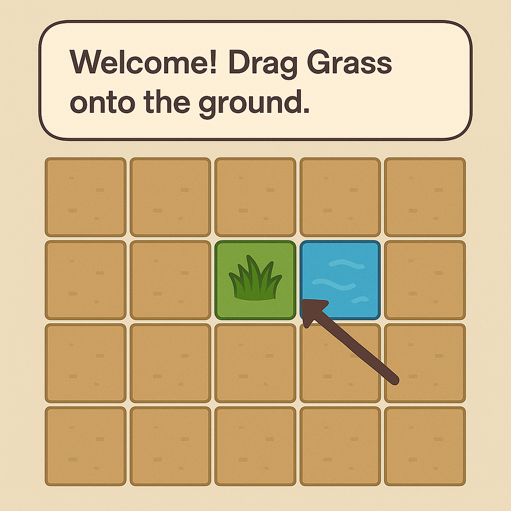
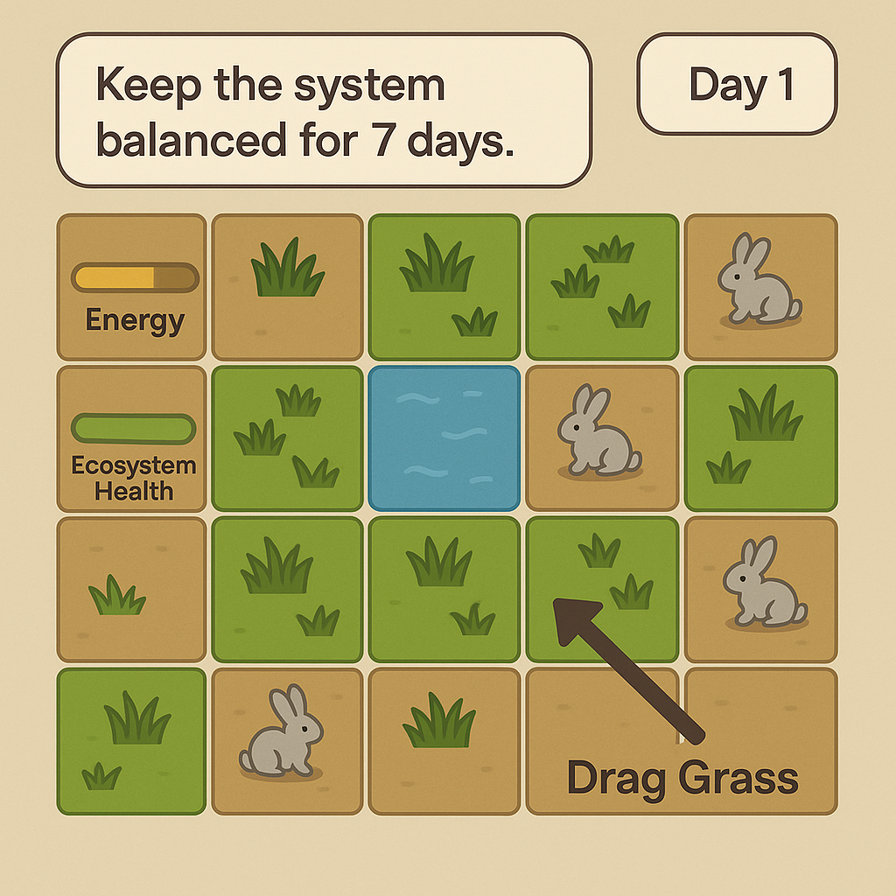
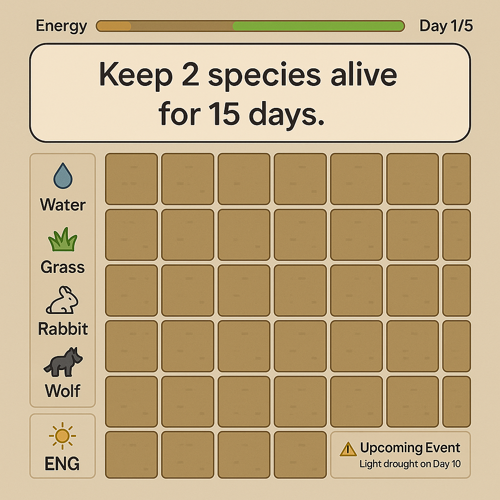
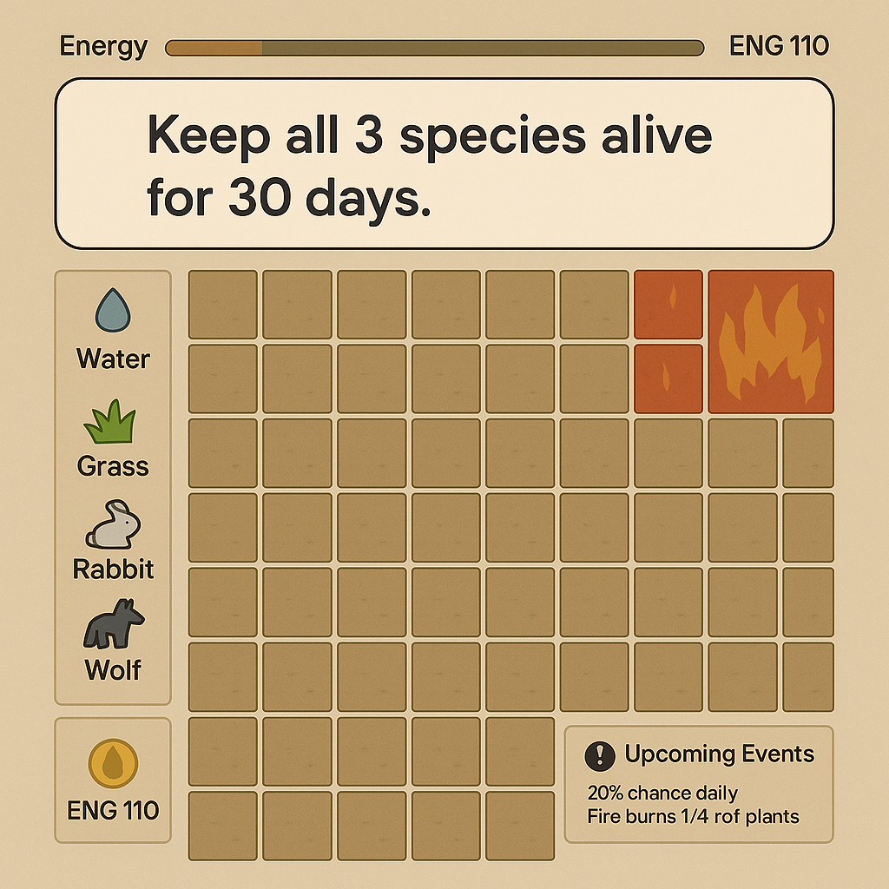

<h1 align="right"> Level Design – EchoLink-System
</h1>

מסמך זה מתאר את תכנון הרמות עבור המשחק, ברמת פירוט מספקת כך שמפתח יוכל לבנות את הרמות בפועל.  
המשחק מבוסס על יצירת איזון ושמירה של המערכת האקולוגית למשך פרק זמן.
תיאור מפורט יותר של המשחק ניתן למצוא ב -
[רכיבים רשמיים (Formal Elements)](../Formal_Elements/formal-elements.md)

 **הערה**: התמונות שיובאו הן להמחשה בלבד כיצד כל חלק אמור להיראות, מה שעוזר להבין כיצד נראה השלב ומה הדרישה
---

## שלב 1 – Tutorial (הדרכה בסיסית)

זוהי רמה של למידה מונחית, לא אתגר. המטרה היא ללמד את חוקי הליבה של המערכת האקולוגית.

### תיאור ומטרה
השחקן מובל צעד-אחר-צעד בסביבה מבוקרת. המשחק עוצר (Pause) עד שהשחקן מבצע את הפעולה הנדרשת, בדומה למשחקי Tycoon.
### רצף ההדרכה
1. "ברוך הבא! בוא ניצור חיים. גרור דשא אל האדמה."  
   → השחקן גורר דשא.
2. "מצוין! דשא צריך מים. גרור אריח מים ליד הדשא."  
   → השחקן גורר מים; הדשא הופך ירוק יותר.
3. "עכשיו נוסיף חיה. גרור ארנב לעולם."  
   → הארנב מופיע.  
   "הארנב רעב - הוא יחפש דשא לאכול."
4. "אוי לא! הארנבים אכלו את כל הדשא. הוסף עוד דשא כדי להציל אותם!"
5. "כל פעולה עולה נקודות אנרגיה. שים לב למד האנרגיה שלך. הוסף עוד 3 ארנבים."

### סיום
"כל הכבוד! הבנת: דשא צריך מים, ארנבים צריכים דשא. נסה לשמור על איזון."

### פרמטרים מפורטים
- גודל רשת: ‎5×5  
- אלמנטים זמינים: דשא, מים, ארנב  
- משאבים: אנרגיה אינסופית או מתחדשת מיידית  
- אירועי טבע: אין  
- מטרה: השלמת כל שלבי ההדרכה  
- תרשים: סקיצה של רשת ‎5×5 עם מיקום דשא, מים וארנב

תמונה להמחשה:

---

## שלב 2 – רמה קלה: "האחו הפורח"

רמה ראשונה של ניהול בסיסי ללא איומים חיצוניים. המטרה היא ליצור מערכת יציבה של צמחים ואוכלי עשב בלבד.

### פרמטרים מפורטים
- גודל רשת: ‎8×8  
- מצב התחלתי: אגם קטן (3 תאי מים) במרכז  
- אלמנטים זמינים:  
  - דשא  
  - ארנב (עלות 5 נק')  
- משאבים: התחדשות מהירה - 1 אנרגיה כל 3 שניות  
- אירועי טבע: אין  
- מטרה: לשמור על מערכת מאוזנת (לפחות 1 דשא ו־1 ארנב) למשך 7 ימים  
- תרשים: רשת ‎8×8 עם תאי מים במרכז

### הסבר רמת הקושי (קלה)
1. שני אלמנטים פעילים בלבד — קל לאזן.  
2. מים קיימים מראש ולכן אינם דורשים ניהול.  
3. התחדשות אנרגיה מהירה מאפשרת תיקון טעויות.  
4. ללא הפתעות - אין אירועי טבע.

תמונה להמחשה:

---

## שלב 3 – רמה בינונית: הכנסת טורף

השחקן חייב לאזן שלוש רמות בשרשרת המזון: דשא → ארנב → זאב, ולהתמודד עם מגבלת אנרגיה אמיתית.

### פרמטרים מפורטים
- גודל רשת: ‎10×10  
- מצב התחלתי: רשת ריקה  
- אלמנטים זמינים:  
  - מים (10 נק')  
  - דשא (5 נק')  
  - ארנב (10 נק')  
  - זאב (20 נק')  
- משאבים: 1 אנרגיה כל 5 שניות  
- אירועי טבע: ביום ה־10 – "בצורת קלה" המאיטה צמיחת דשא ל־3 ימים  
- מטרה: לשמור על דשא, ארנבים וזאבים בחיים למשך 15 יום  
- תרשים: רשת ‎10×10 ריקה

### הסבר רמת הקושי (בינוני)
1. ניהול משאבים מלא – מים עולים אנרגיה.  
2. אירוע חיצוני שבודק יציבות מערכת.  
3. צורך בתכנון לטווח ארוך.

תמונה להמחשה:

---

## שלב 4 – רמה קשה: "אירוע הכחדה"

רמת הישרדות קשה במיוחד. המשאבים מוגבלים, הסיכונים גבוהים והמטרה ארוכת טווח.

### פרמטרים מפורטים
- גודל רשת: ‎20×20  
- מצב התחלתי: רשת ריקה  
- אלמנטים זמינים:  
  - מים (15 נק')  
  - דשא (5 נק')  
  - ארנב (10 נק')  
  - זאב (25 נק')  
- משאבים: התחדשות אנרגיה איטית — 1 נקודה כל 10 שניות  
- אירועי טבע אקראיים:  
  - 20% סיכוי יומי לשריפה שמכחידה רבע מהצמחייה  
  - 10% סיכוי יומי למגפה שמפחיתה את אוכלוסיית הארנבים ב־50%  
- מטרה: לשרוד 30 יום עם כל שלושת המינים  
- תרשים: רשת ‎20×20 עם דוגמה לרביע שנפגע משריפה

### הסבר רמת הקושי (קשה)
1. מחסור חמור במשאבים – כל פעולה יקרה.  
2. סביבה עוינת – אירועים אקראיים קשים.  
3. יעד הישרדות ארוך טווח – נדרש תכנון עמוק ויציבות.

תמונה להמחשה:

